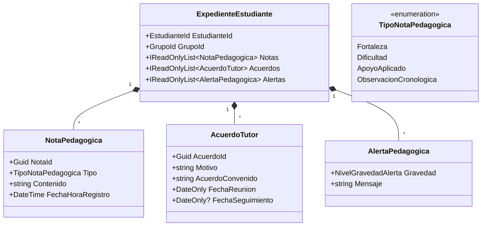

# Design Document: Expediente y Seguimiento Individual del Alumno

## Contexto y Objetivos

El Módulo 4 ("Expediente y seguimiento individual del alumno") consolida la información cuantitativa y cualitativa de cada estudiante para permitir un acompañamiento pedagógico integral bajo la Nueva Escuela Mexicana (NEM).

Objetivos del diseño:
- Reunir en una sola vista: datos generales del alumno, porcentaje histórico de asistencia, entregas por nivel de logro NEM (Domina, Suficiente, En proceso, Requiere apoyo, No entregó, Pendiente), notas cualitativas (fortalezas, dificultades, apoyos pedagógicos) y acuerdos con tutores.
- Mantener las reglas de inmutabilidad en Core, operaciones síncronas ADO.NET sin ORM, inyección manual y migración de base de datos SQLite a `user_version = 5`.
- Evitar términos o diagnósticos médicos/clínicos en las alertas pedagógicas.

## 1. Dominio (`SistemaDocente.Core`)



## 2. Esquema de Persistencia SQLite (`user_version = 5`)

Se agregan dos tablas relacionales en `SistemaDocente.Data`:

```sql
CREATE TABLE IF NOT EXISTS notas_pedagogicas_estudiantes (
    nota_id TEXT PRIMARY KEY NOT NULL,
    estudiante_id TEXT NOT NULL,
    grupo_id TEXT NOT NULL,
    tipo INTEGER NOT NULL, -- 0: Fortaleza, 1: Dificultad, 2: ApoyoAplicado, 3: ObservacionCronologica
    contenido TEXT NOT NULL,
    fecha_hora_registro TEXT NOT NULL,
    FOREIGN KEY(estudiante_id) REFERENCES estudiantes(estudiante_id) ON DELETE CASCADE
);

CREATE TABLE IF NOT EXISTS acuerdos_tutores_estudiantes (
    acuerdo_id TEXT PRIMARY KEY NOT NULL,
    estudiante_id TEXT NOT NULL,
    grupo_id TEXT NOT NULL,
    motivo TEXT NOT NULL,
    acuerdo_convenido TEXT NOT NULL,
    fecha_reunion TEXT NOT NULL,
    fecha_seguimiento TEXT NULL,
    FOREIGN KEY(estudiante_id) REFERENCES estudiantes(estudiante_id) ON DELETE CASCADE
);

PRAGMA user_version = 5;
```

## 3. Capa de Presentación y UI (`GestionExpedienteViewModel` y `ExpedienteEstudianteWindow`)

- `GestionExpedienteViewModel` administra la carga consolidada del estudiante:
  - Carga el expediente cualitativo desde `PersistenciaExpedienteSqlite`.
  - Calcula las estadísticas de asistencia cruzando `GestionAsistenciaCasosUso`.
  - Calcula las estadísticas de actividades cruzando `GestionProyectosActividadesCasosUso`.
- `ExpedienteEstudianteWindow.xaml` despliega una ventana modal con pestañas:
  1. **Ficha y Resumen Pedagógico:** Datos del estudiante, porcentaje de asistencia, indicador visual de nivel NEM más frecuente y tarjetas de Alertas Pedagógicas.
  2. **Fortalezas y Dificultades:** Campos y listas de notas cualitativas con botón de captura.
  3. **Apoyos y Observaciones:** Línea de tiempo de apoyos aplicados y notas cronológicas.
  4. **Acuerdos con Tutores:** Histórico de reuniones y compromisos contraídos con familiares.
